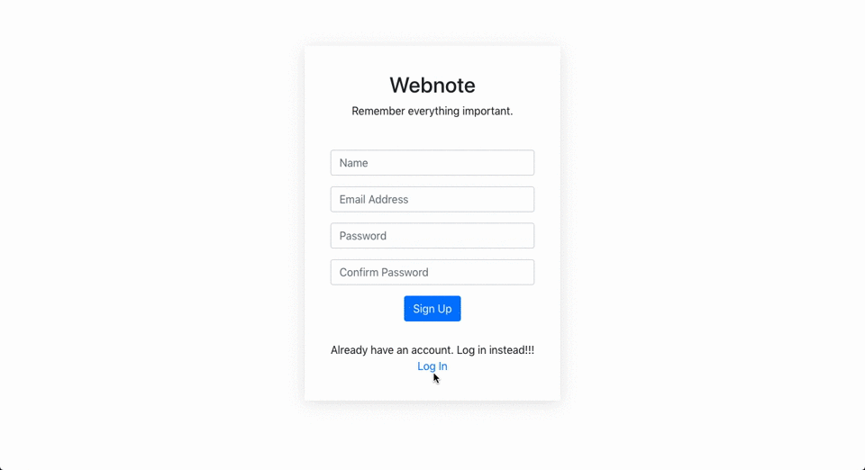

# WebNotes
A note making application build using MERN stack.

### Installation:

1. Install dependencies for server
> npm install

2. Install dependencies for client
> npm run client-install

3. Run the client and server concurrently
> npm run dev

4. Run the server only
> nodemon server

5. Run the client only 
> npm run client

Server runs on http://localhost:4000 and client on http://localhost:3000

### More:

If you dont have mongodb on your system install using the link below.
https://docs.mongodb.com/manual/administration/install-community/

### Why

1. To Practice MERN stack
2. To Practice GitHub flow
